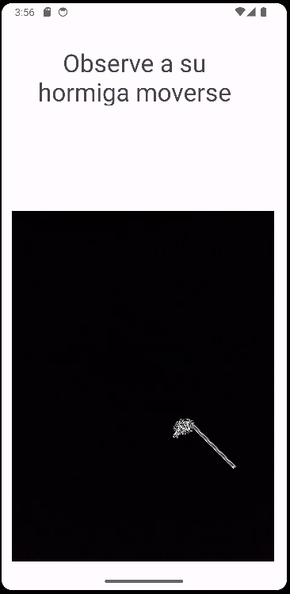
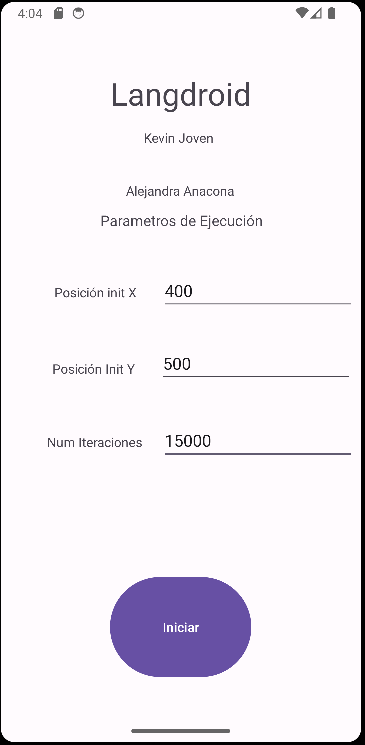

# Dispositivos Moviles

This is final report for the course "Dispositivos Móviles" from Universidad del Valle.
Group members:
- Kevin Jofroit Joven
- Alejandra Anacona

Idea:
We develop the an application using Android Studio about the Langton's Ants called "Langdroid".

The interfaces is divided into two main pieces:
1. Parameter configuration.
2. Ant's behaviour.

## Images from Android Stududio:

  

## Images from real life:

You can download all the code from the data folder.

Enjoy!
